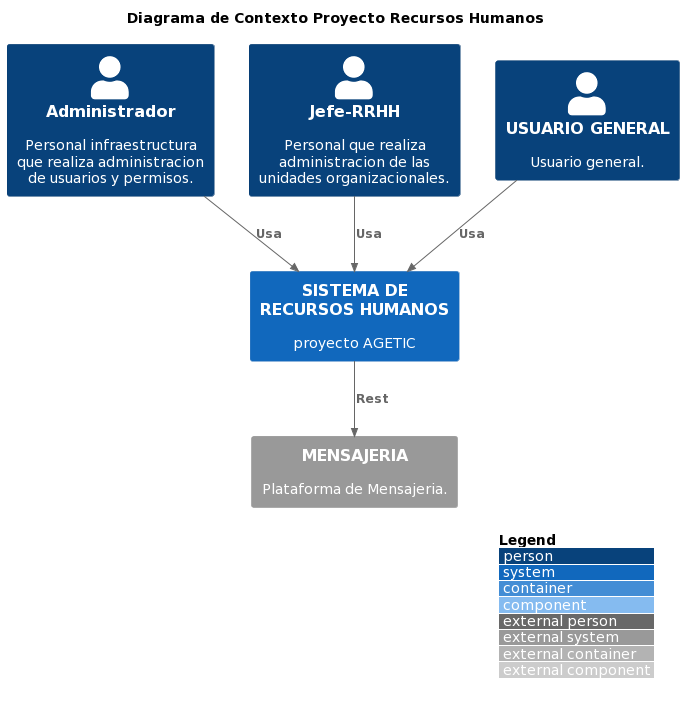
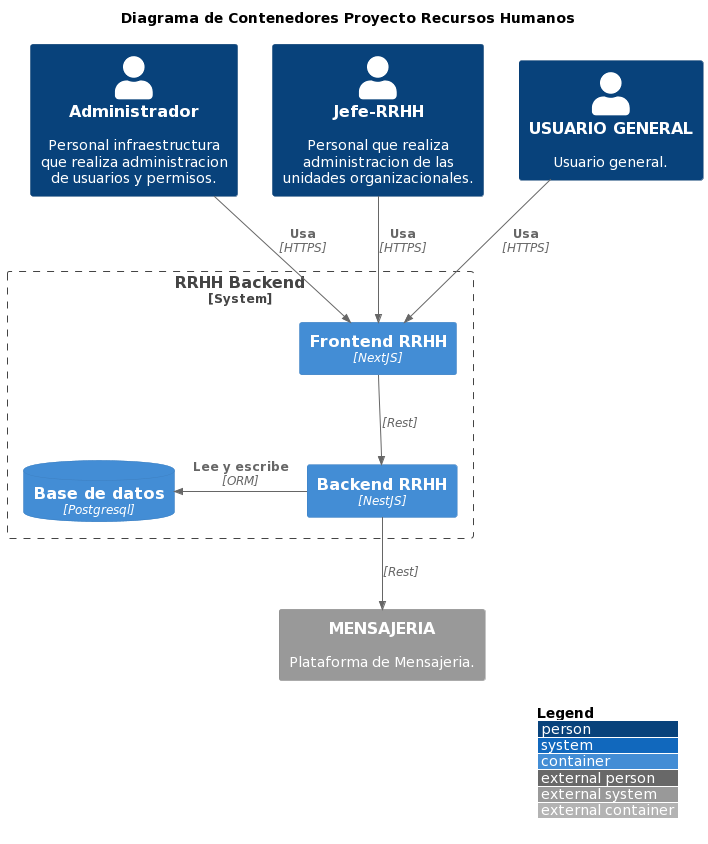
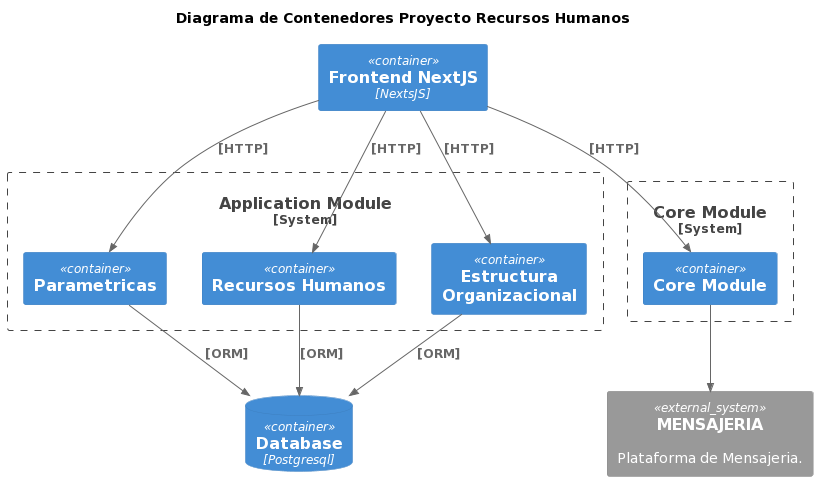
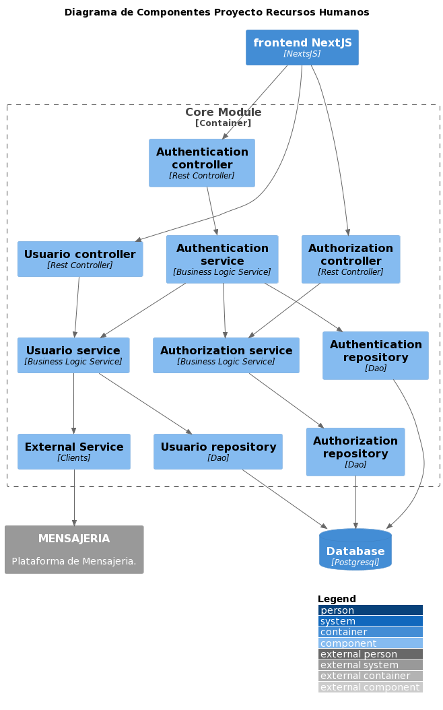
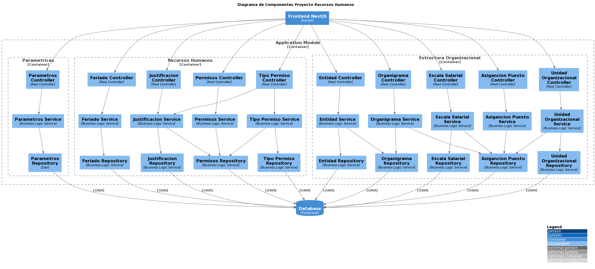

# Diagrama C4

## Diagrama de Contexto


```plantuml
@startuml Diagrama_Contexto

!include  https://raw.githubusercontent.com/plantuml-stdlib/C4-PlantUML/master/C4_Component.puml

LAYOUT_WITH_LEGEND()

title Diagrama de Contexto Proyecto Recursos Humanos

Person(administrador, "Administrador", "Personal infraestructura que realiza administracion de usuarios y permisos.")
Person(jefe_rrhh, "Jefe-RRHH", "Personal que realiza administracion de las unidades organizacionales. ")
Person(usuario, "USUARIO GENERAL", "Usuario general.")


System(proyecto_rrhh, "SISTEMA DE RECURSOS HUMANOS ", "proyecto AGETIC")

System_Ext(mensajeria, "MENSAJERIA", "Plataforma de Mensajeria.")

Rel(administrador, proyecto_rrhh, "Usa")
Rel(jefe_rrhh, proyecto_rrhh, "Usa")
Rel(usuario, proyecto_rrhh, "Usa")

Rel(proyecto_rrhh, mensajeria, "Rest")

@enduml
```

## Diagrama de Contenedores_1

```plantuml
@startuml Diagrama_Contenedores_1

!include https://raw.githubusercontent.com/plantuml-stdlib/C4-PlantUML/master/C4_Container.puml

LAYOUT_WITH_LEGEND()

title Diagrama de Contenedores Proyecto Recursos Humanos

Person(administrador, "Administrador", "Personal infraestructura que realiza administracion de usuarios y permisos.")
Person(jefe_rrhh, "Jefe-RRHH", "Personal que realiza administracion de las unidades organizacionales. ")
Person(usuario, "USUARIO GENERAL", "Usuario general.")

System_Boundary(c2, "RRHH Backend") {
  Container(frontend_rrhh, "Frontend RRHH", "NextJS")
  Container(backend_rrhh, "Backend RRHH", "NestJS")
  ContainerDb(bd_base, "Base de datos", "Postgresql")
}

System_Ext(mensajeria, "MENSAJERIA", "Plataforma de Mensajeria.")

Rel(administrador, frontend_rrhh, "Usa", "HTTPS")
Rel(jefe_rrhh, frontend_rrhh, "Usa", "HTTPS")
Rel(usuario, frontend_rrhh, "Usa", "HTTPS")

Rel(frontend_rrhh, backend_rrhh, "", "Rest")
Rel_Back_Neighbor(bd_base, backend_rrhh, "Lee y escribe", "ORM")
Rel(backend_rrhh, mensajeria, "", "Rest")

@enduml
```

## Diagrama de Contenedores_2

```plantuml
@startuml Diagrama_Contenedores_2
!include https://raw.githubusercontent.com/plantuml-stdlib/C4-PlantUML/master/C4_Container.puml

SHOW_PERSON_PORTRAIT()

title Diagrama de Componentes Proyecto Recursos Humanos

Container(frontend, "Frontend NextJS", "NextJS", "")

ContainerDb(db, "Database", "Postgresql", "")
System_Ext(mensajeria, "MENSAJERIA", "Plataforma de Mensajeria.")


System_Boundary(c1, 'Application Module') {
    Container(parametricas, "Parametricas", "", "")
    Container(recursosHumanos, "Recursos Humanos", "", "")
    Container(estructuraOrganizacional, "Estructura Organizacional", "", "")
}

System_Boundary(c2, 'Core Module') {
    Container(coreModule, "Core Module", "", "")
}

Rel(coreModule, mensajeria, "", "")

Rel(frontend, parametricas, "[HTTP]", "")
Rel(frontend, recursosHumanos, "[HTTP]", "")
Rel(frontend, estructuraOrganizacional, "[HTTP]", "")
Rel(frontend, coreModule, "[HTTP]", "")

Rel(parametricas, db, "[ORM]", "")
Rel(recursosHumanos, db, "[ORM]", "")
Rel(estructuraOrganizacional, db, "[ORM]", "")

@enduml
```


## Diagrama de Componentes Core Module

```plantuml
@startuml Diagrama_Componentes_Core_Module
!include  https://raw.githubusercontent.com/plantuml-stdlib/C4-PlantUML/master/C4_Component.puml

LAYOUT_WITH_LEGEND()

title Diagrama de Componentes Proyecto Recursos Humanos

Container(frontend, "frontend NextJS", "NextsJS", "")

ContainerDb(db, "Database", "Postgresql", "")
System_Ext(mensajeria, "MENSAJERIA", "Plataforma de Mensajeria.")


Container_Boundary(core, "Core Module") {
    Component(externalServices, "External Service", "Clients", "")
    Component(authenticationC, "Authentication controller", "Rest Controller", "")
    Component(authenticationS, "Authentication service", "Business Logic Service", "")
    Component(authenticationR, "Authentication repository", "Dao", "")
    Component(authorizationC, "Authorization controller", "Rest Controller", "")
    Component(authorizationS, "Authorization service", "Business Logic Service", "")
    Component(authorizationR, "Authorization repository", "Dao", "")
    Component(usuarioC, "Usuario controller", "Rest Controller", "")
    Component(usuarioS, "Usuario service", "Business Logic Service", "")
    Component(usuarioR, "Usuario repository", "Dao", "")


    Rel(authenticationC, authenticationS, "", "")
    Rel(authenticationS, authorizationS, "", "")
    Rel(authenticationR, db, "", "")
    Rel(authorizationC, authorizationS, "", "")
    Rel(authorizationS, authorizationR, "", "")
    Rel(authenticationS, authenticationR, "", "")
    Rel(authorizationR, db, "", "")
    Rel(usuarioC, usuarioS, "", "")
    Rel(usuarioS, usuarioR, "", "")
    Rel(usuarioR, db, "", "")
    Rel(usuarioS, externalServices, "", "")
    Rel(authenticationS, usuarioS, "", "")
}

Rel(externalServices, mensajeria, "", "")

Rel(frontend, authenticationC, "", "")
Rel(frontend, authorizationC, "", "")
Rel(frontend, usuarioC, "", "")

@enduml

```

## Diagrama de Componentes Aplication Module

```plantuml
@startuml Diagrama_Componentes_AplicationModule
!include  https://raw.githubusercontent.com/plantuml-stdlib/C4-PlantUML/master/C4_Component.puml

LAYOUT_WITH_LEGEND()

title Diagrama de Componentes Proyecto Recursos Humanos

Container(frontend, "Frontend NextJS", "NextJS", "")

ContainerDb(db, "Database", "Postgresql", "")

Container_Boundary(aplication, "Application Module") {

    Container_Boundary(aplicationParametricas, "Parametricas") {
        Component(parametrosC, "Parametros Controller", "Rest Controller", "")
        Component(parametrosS, "Parametros Service", "Business Logic Service", "")
        Component(parametrosR, "Parametros Repository", "Dao", "")

        Rel(parametrosC, parametrosS, "", "")
        Rel(parametrosS, parametrosR, "", "")

        Rel(parametrosR, db, "[ORM]", "")
    }

    Container_Boundary(aplicationRecursosHumanos, "Recursos Humanos") {
        Component(feriadosC, "Feriado Controller", "Rest Controller", "")
        Component(feriadosS, "Feriado Service", "Business Logic Service", "")
        Component(feriadosR, "Feriado Repository", "Business Logic Service", "")

        Component(justificacionC, "Justificacion Controller", "Rest Controller", "")
        Component(justificacionS, "Justificacion Service", "Business Logic Service", "")
        Component(justificacionR, "Justificacion Repository", "Business Logic Service", "")

        Component(permisoC, "Permisos Controller", "Rest Controller", "")
        Component(permisoS, "Permisos Service", "Business Logic Service", "")
        Component(permisoR, "Permisos Repository", "Business Logic Service", "")

        Component(tipoPermisoC, "Tipo Permiso Controller", "Rest Controller", "")
        Component(tipoPermisoS, "Tipo Permiso Service", "Business Logic Service", "")
        Component(tipoPermisoR, "Tipo Permiso Repository", "Business Logic Service", "")

        Rel(frontend, feriadosC, "", "")
        Rel(frontend, justificacionC, "", "")
        Rel(frontend, permisoC, "", "")
        Rel(frontend, tipoPermisoC, "", "")

        Rel(feriadosC, feriadosS, "", "")
        Rel(feriadosS, feriadosR, "", "")
        Rel(justificacionC, justificacionS, "", "")
        Rel(justificacionS, justificacionR, "", "")
        Rel(permisoC, permisoS, "", "")
        Rel(permisoS, permisoR, "", "")
        Rel(tipoPermisoC, tipoPermisoS, "", "")
        Rel(tipoPermisoS, tipoPermisoR, "", "")

        Rel(feriadosR, db, "[ORM]", "")
        Rel(justificacionR, db, "[ORM]", "")
        Rel(permisoR, db, "[ORM]", "")
        Rel(tipoPermisoR, db, "[ORM]", "")

    }

    Container_Boundary(aplicationEstructuraOrganizacional, "Estructura Organizacional") {
        Component(asignacionPuestoC, "Asigancion Puesto Controller", "Rest Controller", "")
        Component(asignacionPuestoS, "Asigancion Puesto Service", "Business Logic Service", "")
        Component(asignacionPuestoR, "Asigancion Puesto Repository", "Business Logic Service", "")

        Component(entidadC, "Entidad Controller", "Rest Controller", "")
        Component(entidadS, "Entidad Service", "Business Logic Service", "")
        Component(entidadR, "Entidad Repository", "Business Logic Service", "")

        Component(organigramaC, "Organigrama Controller", "Rest Controller", "")
        Component(organigramaS, "Organigrama Service", "Business Logic Service", "")
        Component(organigramaR, "Organigrama Repository", "Business Logic Service", "")

        Component(escalaSalarialC, "Escala Salarial Controller", "Rest Controller", "")
        Component(escalaSalarialS, "Escala Salarial Service", "Business Logic Service", "")
        Component(escalaSalarialR, "Escala Salarial Repository", "Business Logic Service", "")

        Component(unidadOrganizacionalC, "Unidad Organizacional Controller", "Rest Controller", "")
        Component(unidadOrganizacionalS, "Unidad Organizacional Service", "Business Logic Service", "")
        Component(unidadOrganizacionalR, "Unidad Organizacional Repository", "Business Logic Service", "")

        Rel(frontend, asignacionPuestoC, "", "")
        Rel(frontend, entidadC, "", "")
        Rel(frontend, organigramaC, "", "")
        Rel(frontend, escalaSalarialC, "", "")
        Rel(frontend, unidadOrganizacionalC, "", "")

        Rel(asignacionPuestoC, asignacionPuestoS, "", "")
        Rel(asignacionPuestoS, asignacionPuestoR, "", "")
        Rel(entidadC, entidadS, "", "")
        Rel(entidadS, entidadR, "", "")
        Rel(organigramaC, organigramaS, "", "")
        Rel(organigramaS, organigramaR, "", "")
        Rel(escalaSalarialC, escalaSalarialS, "", "")
        Rel(escalaSalarialS, escalaSalarialR, "", "")
        Rel(unidadOrganizacionalC, unidadOrganizacionalS, "", "")
        Rel(unidadOrganizacionalS, unidadOrganizacionalR, "", "")

        Rel(asignacionPuestoR, db, "[ORM]", "")
        Rel(entidadR, db, "[ORM]", "")
        Rel(organigramaR, db, "[ORM]", "")
        Rel(escalaSalarialR, db, "[ORM]", "")
        Rel(unidadOrganizacionalR, db, "[ORM]", "")
     
    }
}

Rel(frontend, parametrosC, "", "")

Rel(justificacionS, permisoR, "", "")
Rel(tipoPermisoS, permisoR, "", "")
Rel(tipoPermisoC, justificacionS, "", "")
Rel(organigramaS, asignacionPuestoR, "", "")
Rel(entidadS, organigramaR, "", "")
Rel(escalaSalarialS, asignacionPuestoR, "", "")
Rel(unidadOrganizacionalS, asignacionPuestoR, "", "")


@enduml

```
